# Setting Up A Delta Lake For Querying

The goal of this project is to learn how to use the delta lake format to store tables in AWS that can be queried with AWS Athena. The data used for this project was fantasy football data from the time period 1970 to 2021 (source: [bendominguez0111/fantasy-csv-data](https://github.com/bendominguez0111/fantasy-csv-data)). By following the steps in the README, you should be able to follow along, setup the appropriate services in AWS and construct a query that returns the average fantasy points among top quarterbacks, running backs and wide recievers for each year.

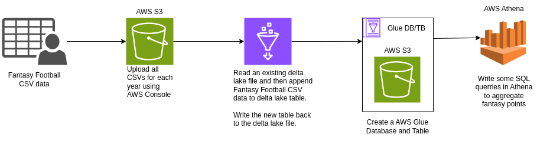

## Prerequisites

* Poetry

    ```shell
    curl -sSL https://install.python-poetry.org | python3 -
    ```

* Java

    ```shell
    sudo apt install default-jre default-jdk
    ```

* AWS Account

## Follow Along

1. Clone the repository to your local machine

1. Download the required dependencies

    ```shell
    poetry init
    ```

### S3 Bucket

1. Create a new S3 bucket. Most of the defualt settings can be left. Remember the bucket name should be unique within AWS.

    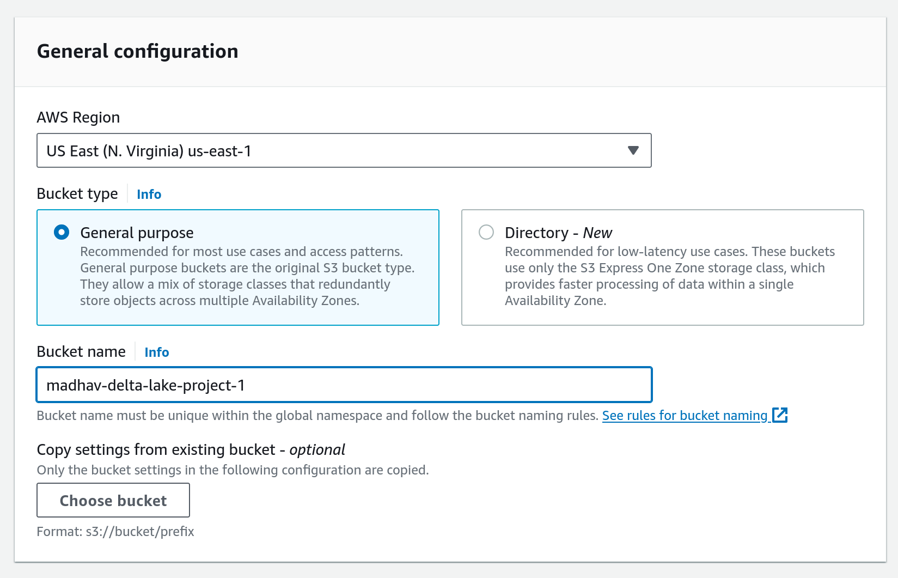

1. Create the following folder structure within the bucket

    ```
    madhav-delta-lake-project-1/
    ├── athena
    ├── database
    │   └── raw
    └── scripts
    ```

1. Upload all the .csv files *directly* under data to database/raw. Do not upload the .csv files under archive.

### IAM Permissions

1. Go to IAM and select *Create Role*

    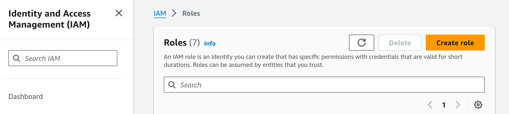

1. Configure Trusted Entity (*AWS Service*) and Use Case (*Glue*)

    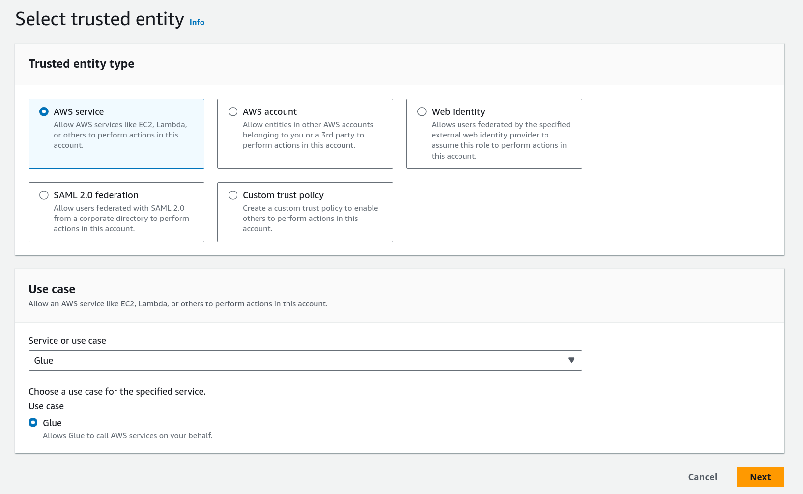

1. Give the role administrator access

    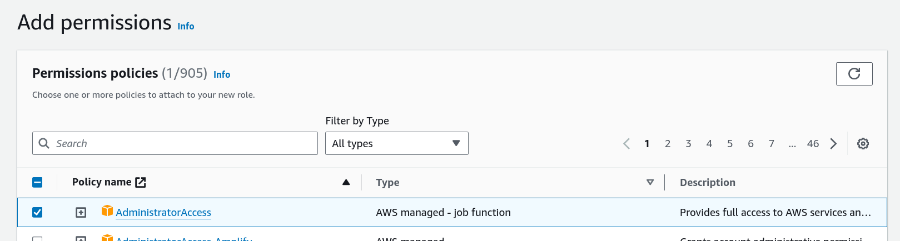

1. Give the role a name

    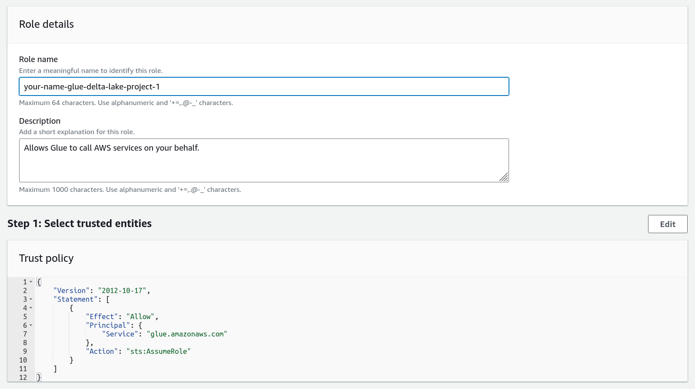

### Initialize Delta Lake

We will create a table in our delta lake with the following schema.

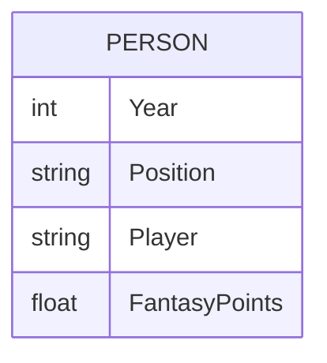

1. Review the *init_delta_lake.ipynb* notebook. In order to run the notebook successfully, you will need the following configured.

    - Access key in ~/.aws/config
    - Secret key in ~/.aws/config
    - Correct hadoop-aws package version installed
    - `BUCKET_NAME` set

1. Select the proper kernel (.venv) for the notebook.

    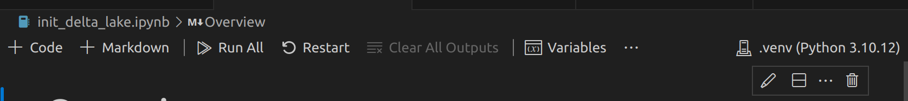

1. Run the cells in the notebook after configuration.

### Run AWS Glue Crawler

1. Navigate to AWS Glue Crawler and click *Create crawler*

1. Give a name for the crawler e.g. *ff-delta-lake*. Next.

1. Add a data source and make sure to select delta lake. Provide a path to the folder containing the parquet files. It should be s3://bucket-name/database/top_performers_delta/. Next.

    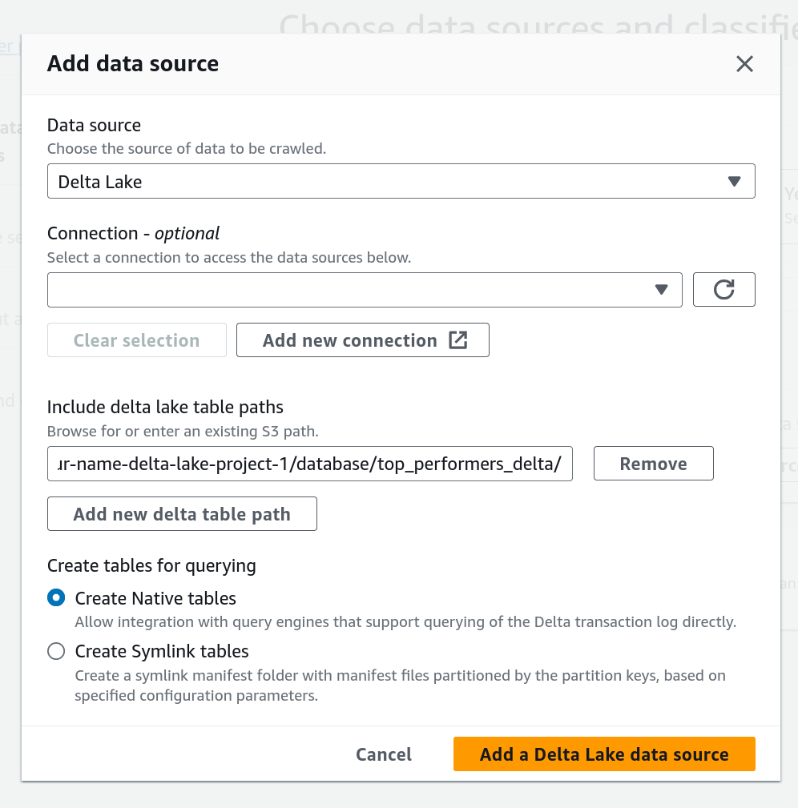

1. Select the IAM role you created for the crawler. Next.

1. In *Output Configuration*, select *Add databse*, and add a new database to the Glue Catalog name *delta_lake*. Close the tab and return back to crawler configuration and select the newly created database. Refresh the list of databases if necessary. Next.

    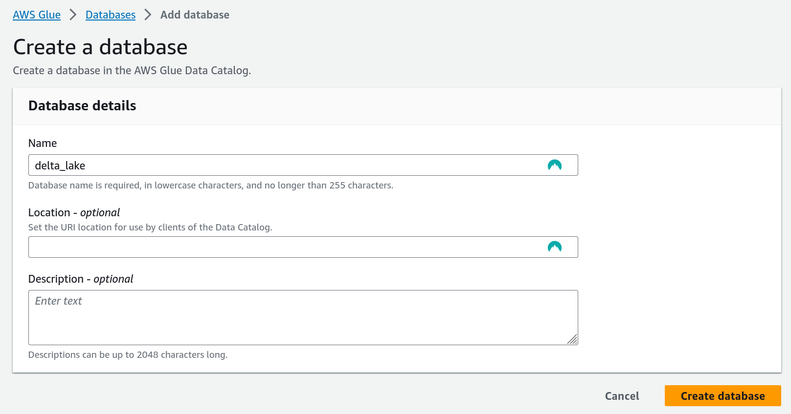

1. Review and *Create Crawler*. Run the crawler. After about a minute, navigate to AWS Glue > Tables. You should see a new table named *top_performers_delta*. Select the table and the schema should be visible.

    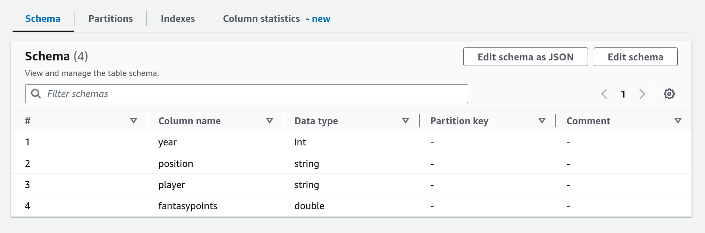

### Glue Job

The job `csv_to_delta.ipynb` reads data from all of the CSV files, extracts the top 12 fantasy performers per position, and writes the data to the delta lake storage layer on S3. The Glue job can be run through a local notebook by connecting to an AWS Interactive Session or by uploading the notebook to the cloud. Follow either of the below instructions.

#### Triggering Locally

1. Add `glue_iam_role=arn:aws:iam::<AccountID>:role/<GlueServiceRole>` to your *~/.aws/config* file. Obtain the proper ARN from IAM > Roles > your-name-glue-delta-lake-project-1. See [Configuring sessions with named profiles](https://docs.aws.amazon.com/glue/latest/dg/interactive-sessions-magics.html) for more details.

1. In a new terminal in the project repo, run `poetry shell`

1. `jupyter notebook`. Copy the jupyter server URL.

1. Open *csv_to_delta.ipynb*, *Select Kernel* -> *Select Another Kernel...* -> Paste URL and select PySpark.

    

1. Review the notebook. Set the `BUCKET_NAME` correctly. Then run the notebook.

1. To confirm the write was successfull, navigate to *s3://your-name-delta-lake-project-1/database/top_performers_delta/_delta_log/*. You should observe two .json files. The first representing the initial write transaction, and the second representing the glue jobs table append.

#### Triggering In AWS

### Use Athena To Query

## Resources

- [https://aws.amazon.com/blogs/big-data/introducing-native-delta-lake-table-support-with-aws-glue-crawlers/](https://aws.amazon.com/blogs/big-data/introducing-native-delta-lake-table-support-with-aws-glue-crawlers/)
